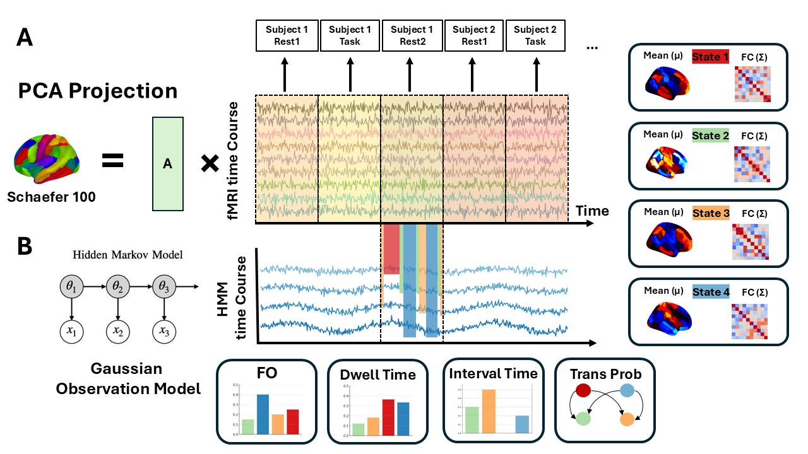

# The alternated brain states in resting state after Immoral decisions 

Code and data for **The alternated brain states in resting state after Immoral decisions**, accompanying the preprint: 

**E.,Wang, XJ, Xu, R., J. H, Wu (2025). The alternated brain states in resting state after Immoral decisions.** *bioRxiv* <br/>

<br/>
___
## **Abstract**
Instances of dishonesty may induce feelings of anxiety or guilt, leading to evident "after-effects" that impact subsequent behaviour and neural activity. However, which functional networks are particularly involved in the reconfiguration of brain states relating to moral decision-making, and to what extent do these network reconfigurations capture the neural and behavioral correlates of motivated dishonesty are still unclear. This study aimed to investigate how moral decisions influence resting brain states using both rs-fMRI and task-fMRI data collected before, during and after an information-passing task involving dishonest choices with rewards. We utilized an advanced computational model called the Hidden Markov Model (HMM) to explore brain dynamics as the task unfold.

___
## **Introduction**
This repository includes code to replicate the analysis and produce figures in the paper. In short, our analysis includes 3 parts.

* Step 1: Hidden Markov Modelling (HMM) (see **Methodology** for more detail)
* Step 2: HMM dynamics
* Step 3: HMM and behavior (Motivated dishonesty & DDM parameter)

The HMM results in 4 discrete brain states. To quantify the functional relevance of these inferred states, we used Neurosynth decoding model to map the spatial expression of each state onto Neurosynth topics. 

## **Methodology**
### Hidden Markov Model

<div align=center>
      
</div>
<br/>

HMM used in this study is developed by [Diego Vidaurre](https://scholar.google.co.uk/citations?user=krbBtukAAAAJ&hl=en). This model has been used to study the dynamic nature of serval neuroimaging modalities.

The model consists of two parts:
* The Hidden States, in which *k* number of latent variables exists in the hidden spaces.

* The Observed Data, in which the generated data given the hidden states

### Generative Model

The Generative Model can be used to represent the underlying generative process from latent states to observed data. It can be written down mathematically by specifying the joint distribution of observed and latent variables. The joint probability distribution for the HMM generating a sequence of data is:

$$
p(x_{1:T}, \theta_{1:T}) = p(x_1 | \theta_1) p(\theta_1) \prod_{t=2}^{T} p(x_t | \theta_t) p(\theta_t | \theta_{t-1}),
$$

where $\( x_{1:T} \)$ denotes a sequence of observed data $\( (x_1, x_2, \dots, x_T) \)$ and $\( \theta_{1:T} \)$ denotes a sequence of hidden states $\( (\theta_1, \theta_2, \dots, \theta_T) \)$.

$\( p(x_t | \theta_t) \)$ is the probability distribution for the observed data given the hidden state. In this study, we use a Gaussian distribution to specify this distribution.

$$
p(x_t | \theta_t = k) = \mathcal{N}(m_k, C_k),
$$

where $\( m_k \)$ and $\( C_k \)$ are state means and covariances, and $\( k \)$ indexes the state that is active, and $\( p(\theta_t | \theta_{t-1}) \)$ is the temporal model for the hidden state.

### Inferences

Variational Bayesian (VB) approach is employed for inference in Hidden Markov Models (HMMs). VB approximate the posterior distribution of the model parameters analytically by iteratively updating parameter on batches. Here, the parameters include

* The transition probability matrix, $( p(\theta_t | \theta_{t-1}) \)$.
* The hidden state at each time point, $\( \theta_t \)$.
* The observation model parameters: state means, $\( m_k \)$, and covariances, $\( C_k \)$

Over time, it will converge to the best model parameters for generating the observed data.

However, HMM normally face significiant challenges to estimate potentially billions of parameters from limited data. For more detail, please see disucssion by [Ahrends et al., 2022](https://pubmed.ncbi.nlm.nih.gov/35217207/). Therefore, a common practice is to conduct HMM inference in PCA space to reduce the dimensionality. 

### Viterbi Algorithm

After fitting the Hidden Markov Model (HMM) using observed data, the **Viterbi path**—defined as the most likely sequence of hidden states—can be computed using the **Viterbi algorithm**. The Viterbi algorithm is a dynamic programming algorithm used to find the most likely sequence of hidden states given an observed sequence of data. Simply put, it maximizes the likelihood of a sequence of hidden states that could have produced the observed data, assigning each time point to one specific state based on the overall highest probability. From here, we can use the state-timecourse to compute 4 dynamic metrics (sometimes referred to as "chronnectome"), that is, fractional occupancies (the proportion of time each participant spent in each brain state), dwell time (the average duration in one visits to a certain state),  interval times (the average duration between visits to the same state) and switching rate (frequency with which participants transitioned between all brain states).
___
## **Code**


**This repository contains:**
```
│  README.md
│
├─HMM-MAR-master # HMM model root file, add this in MATLAB directory
│
├─Neurosynth # Neurosynth decoder, please download neurosynth and run python notebook
│      neurosynth.ipynb
│      state_1.nii.gz
│      state_2.nii.gz
│      state_3.nii.gz
│      state_4.nii.gz
│
├─README_graph
│      hmm_process.JPG
│      HMM_state.gif
│
├─Step1 # Step1: Find best HMM and fit HMM to the data
│      data.mat
│      GammaList.mat
│      K_4_HMM_NOpca.mat
│      K_4_HMM_pca80.mat
│      K_4_HMM_pca90.mat
│      step1.mat
│      Step1_Find_K_number.m
│
├─Step2 # Step2: Brain dynamics analysis
│      data.mat
│      K_4_HMM_pca80.mat
│      Step2_Analysis_hmm.m
│
└─Step3 # Step3: Brain dynamics and behavior
        Behavior-HMM.xlsx
        behavior_data_summary.xlsx
        Step3_Behavior.m

```
___
## How to use
* [Step 1](Step1) contains find k number for HMM .<br />

* [Step 2](Step2) contains the 4-state solution HMM and instruction for extracting its dynamic metrics across different sessions.<br />

* [Step 3](Step3) contains the analysis between the dynamic metrics and behavior (motivated lie rate and DDM parameters).<br />

* You should run the neurosynth decoding [neurosynth.ipynb](Neurosynth) codes separately from Matlab. 
___

For bug reports, please contact Eric Wang ([ericwang@um.edu.mo](mailto:ericwang@um.edu.mo), or through X [@ericwan53761434](https://x.com/ericwan53761434) or through bluesky [@neuro-psyc-eric.bsky.social](https://bsky.app/profile/neuro-psyc-eric.bsky.social).
