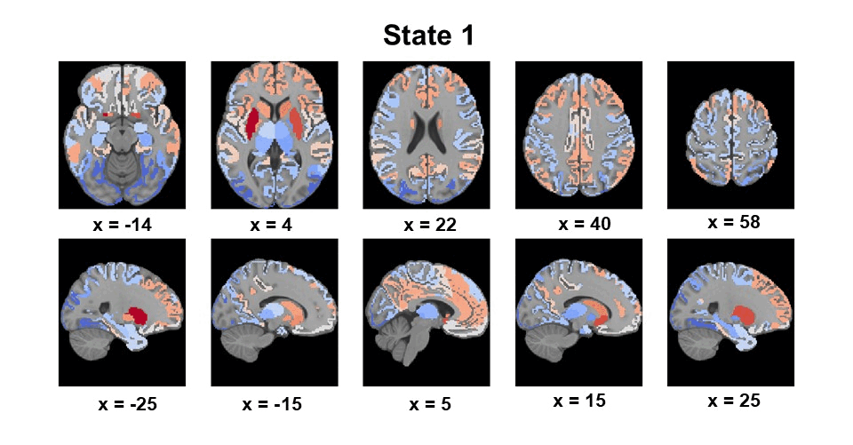
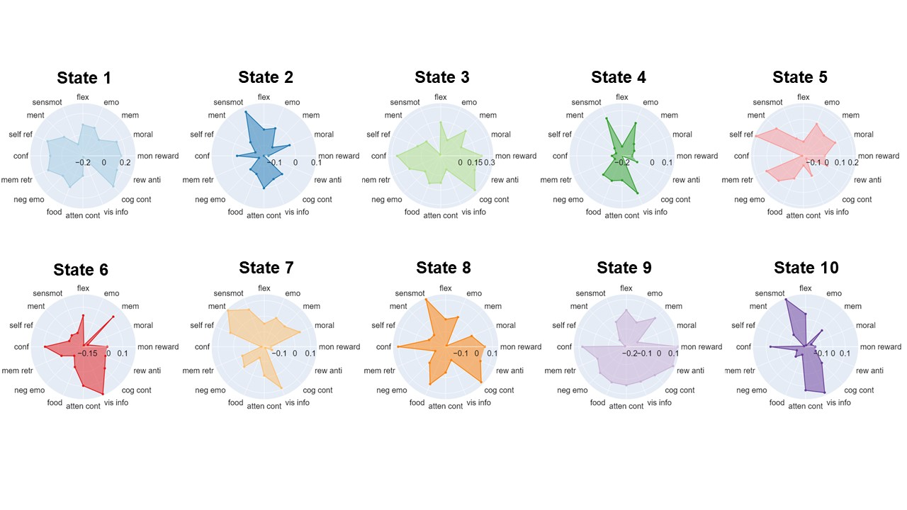
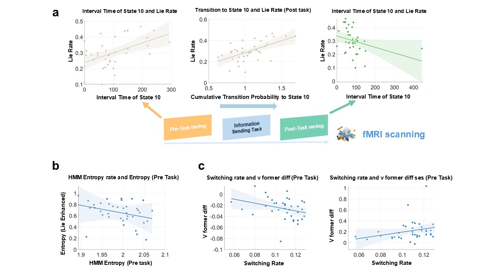
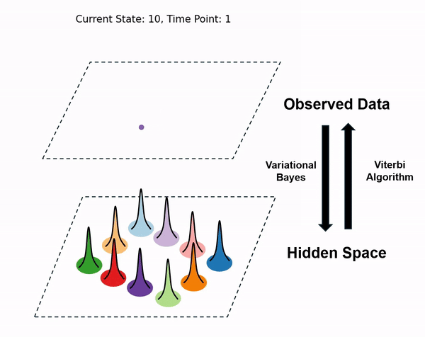

# Alternated Brain State after Moral Decisions 

Code and data for **The alternated brain states**, accompanying the preprint: 

**E.,Wang, XJ, Xu, R., J. H, Wu (2024). The alternated brain states in resting state after moral decisions.** *bioRxiv* <br/>

<br/>
___
## **Abstract**
Instances of dishonesty may induce feelings of anxiety or guilt, leading to evident "after-effects" that impact subsequent behaviour and neural activity. However, how constantly switching moral decisions affects the brain states and what behavioural variable is primarily responsible
for the changing effect is still unclear. This study aimed to investigate how moral decisions influence resting brain states using rs-fMRI data collected before and after an information-passing task involving dishonest choices with rewards. We used multimodal fMRI (task-fMRI and rs-fMRI) and behavioural data and utilized an advanced computational model called the Hidden Markov Model (HMM) to explore brain dynamics during this process.

___
## **Introduction**
This repository includes code to replicate the analysis and produce figures in the paper. In short, our analysis includes 3 parts.

* Resting-State fMRI (rs-fMRI) Hidden Markov Modelling (HMM) (see **Methodology** for more detail)
* rs-fMRI HMM and Behaviroal data
* rs-fMRI HMM and Task fMRI

As shown in the picture above, the HMM results in 10 discrete states. To quantify the functional relevance of these inferred states, we used Neurosynth decoding model to map the spatial expression of each state onto Neurosynth topics.

<div align=center>
      
</div>
<br/>

Post-hoc analysis shows that the interval time (as a measure of frequency in visiting the state) of state 10, the state transition rate, and model entropy are significantly related to several behavioral data, and one of these results is shown below (refer to the paper for details)

<div align=center>
      
</div>
<br/>

## **Methodology**
### Hidden Markov Model

<div align=center>
      
</div>
<br/>

HMM is a popular model developed by [Diego Vidaurre](https://scholar.google.co.uk/citations?user=krbBtukAAAAJ&hl=en). This model has been used to study the dynamic nature of serval neuroimaging modalities.

The model consists of two parts:
* The Hidden States, in which *k* number of latent variables exists in the hidden spaces.

* The Observed Data, in which the generated data given the hidden states

### Generative Model

The Generative Model can be used to represent the observed data. It can be written down mathematically by specifying the joint distribution of observed and latent variables. The joint probability distribution for the HMM generating a sequence of data is:

$$
p(x_{1:T}, \theta_{1:T}) = p(x_1 | \theta_1) p(\theta_1) \prod_{t=2}^{T} p(x_t | \theta_t) p(\theta_t | \theta_{t-1}),
$$

where $\( x_{1:T} \)$ denotes a sequence of observed data $\( (x_1, x_2, \dots, x_T) \)$ and $\( \theta_{1:T} \)$ denotes a sequence of hidden states $\( (\theta_1, \theta_2, \dots, \theta_T) \)$.

$\( p(x_t | \theta_t) \)$ is the probability distribution for the observed data given the hidden state. In this study, we use a Gaussian distribution to specify this distribution.

$$
p(x_t | \theta_t = k) = \mathcal{N}(m_k, C_k),
$$

where $\( m_k \)$ and $\( C_k \)$ are state means and covariances, and $\( k \)$ indexes the state that is active, and $\( p(\theta_t | \theta_{t-1}) \)$ is the temporal model for the hidden state.

### Inferences

Variational Bayesian (VB) approach is employed for inference in Hidden Markov Models (HMMs). VB approximate the posterior distribution of the model parameters analytically by iteratively updating parameter on batches. Here, the parameters include

* The transition probability matrix, $( p(\theta_t | \theta_{t-1}) \)$.
* The hidden state at each time point, $\( \theta_t \)$.
* The observation model parameters: state means, $\( m_k \)$, and covariances, $\( C_k \)$

Simply, the way VB works is:

* We randomly initialize approximate distributions for model parameters (known as an **approximate posterior distribution**). i.e. we propose the distribution $( q(\cdot) $) for the model parameters.
* We use the generative model to calculate a cost function (**variational free energy**), which captures the likelihood of our current model parameters generating the data we have observed.
* We tweak the model parameters' distributions $( q(\cdot) \$) to minimize the cost function.
* We take the most likely value from $( q(\cdot) \$) as our estimate for the model parameters (this is known as the **MAP estimate**).

Over time, it will converge to the best model parameters for generating the observed data.

### Viterbi Algorithm

After fitting the Hidden Markov Model (HMM) using observed data, the **Viterbi path**—defined as the most likely sequence of hidden states—can be computed using the **Viterbi algorithm**. Unlike the state time courses, which represent probabilities of being in different states at each time point, the Viterbi path assigns each time point to one specific state.

The Viterbi algorithm is a dynamic programming algorithm used to find the most likely sequence of hidden states given an observed sequence of data. It works by maximizing the joint probability of the state sequence and the observations. The key steps are:

1. **Initialization**:
   - At time $\( t = 1 \)$, initialize the probability of each state based on the initial state distribution and the likelihood of observing the first data point given each state.

   $$ delta(1, j) = \pi_j \cdot p(x_1 | \theta_1 = j),$$
   
Where
   - **$\( \delta(1, j) \)$**: The most probable path probability at time $\( t = 1 \)$ for reaching state $\( j \)$. It represents the highest probability of being in state $\( j \$) at time $\( t = 1 \)$.
   - **$\( \pi_j \)$**: The initial probability of being in state \( j \). This term reflects the prior probability that the model starts in state $\( j \)$.
   - **$\( p(x_1 | \theta_1 = j) \)$**: The likelihood of observing $\( x_1 \)$ given that the hidden state at time $\( t = 1 \)$ is $\( j \)$. This measures how well state $\( j \)$ explains the first observation.

3. **Recursion**:
   - For each subsequent time step $\( t = 2, 3, \dots, T \)$, compute the most likely path to each state by considering all possible paths leading to that state. This step uses the previous state probabilities and the transition probabilities between states.

   $$\delta(t, j) = \max_i \left[ \delta(t-1, i) \cdot p(\theta_t = j | \theta_{t-1} = i) \right] \cdot p(x_t | \theta_t = j),$$

Where
   - **$\( \delta(t, j) \)$**: The most probable path probability at time $\( t \)$ for reaching state $\( j \)$, given the observations up to time $\( t \)$. This term finds the maximum probability of being in state $\( j \$) at time $\( t \)$ by considering all the possible states at the previous time step.
   - **$\( \max_i \left[ \delta(t-1, i) \cdot p(\theta_t = j | \theta_{t-1} = i) \right] \)$**: This finds the maximum probability path to state $\( j \)$ at time $\( t \)$, considering all states $\( i \)$ at the previous time step. $\( p(\theta_t = j | \theta_{t-1} = i) \)$ is the transition probability from state $\( i \$) to state $\( j \)$.
   - **$\( p(x_t | \theta_t = j) \)$**: The likelihood of observing $\( x_t \)$ given that the hidden state at time $\( t \)$ is $\( j \)$. It measures how well state $\( j \)$ explains the observation at time $\( t \)$.

4. **Termination**:
   - At the final time step \( T \), determine the state with the highest probability, which corresponds to the end of the most likely sequence of states.

   $$ s_T^* = \arg\max_j \delta(T, j),$$

Where
   - $**( s_T^* )**$: The most likely state at the final time step $\( T \)$. This identifies which state maximizes the probability of the entire path.

6. **Backtracking**:
   - Once the final state is identified, trace back through the stored paths to recover the most likely sequence of states, working backward from $\( t = T \$) to $\( t = 1 \)$.

___
## **Code**


**This repository contains:**
```
root
 ├── ua_code # Main analysis code
 │    ├── HMM-MAR-master # External Matlab package for HMM
 │    ├── figures # directory containing all output figures from HMM analysis code
 │    ├── input_data # input data, contains fmri and behavioral data
 │    │   ├── Task # Contain task fmri data
 │    │   │    ├── subj_data # all subjects' data in task
 │    │   │    ├── activation_data.xlsx # all subjects' data summary
 │    │   │    ├── task.ipynb # for extracting the summary
 │    │   │
 │    │   ├── Behavioral_data.mat # Contain task behavioral data
 │    │   ├── MNI152lin_T1_2mm_brain.nii.gz # standard MNI mask
 │    │   ├── Tian_Subcortex_S1_3T_2009cAsym.nii.gz # Tian network
 │    │   ├── Yeo2011_17Networks_MNI152_FreeSurferConformed1mm.nii.gz # Yeo network
 │    │   
 │    │
 │    ├── neurosynth # neurosynth folder
 │    │   ├── neurosynth.ipynb # Main neurosynth code
 │    │   ├── State_activation # input for neurosynth
 │    │   ├── neurosynth_output # Contain neurosynth summary on all keywords
 │    │
 │    ├── output_HMM # directory containing folder related to HMM output, like state activation, transition probability and so on
 │    │   ├── Brain_states # contains 10 states of activation
 │    │   │   ├── output_states_tian # tian network activation 
 │    │   │   ├── output_states_yeo # yeo network activation 
 │    │   │   ├── covars.mat # HMM 10 states covariance
 │    │   │   ├── Mean_states.mat # 10 state activation on tian+yeo network
 │    │   │   
 │    │   ├── C-H_scores # contain K = 2 to 10 cross-validated C-H score
 │    │   │   ├── K2
 │    │   │   ├── K3
 │    │   │   ├── K4
 │    │   │   ├── K5
 │    │   │   ├── K6
 │    │   │   ├── K7
 │    │   │   ├── K8
 │    │   │   ├── K9
 │    │   │   ├── K10
 │    │   │   
 │    │   │
 │    │   ├── HMM_Model_K10 # contain HMM model
 │    │   ├── TP # contains all subjects' state transition probability
 │    │   ├── Task # contains significant comparison pairs between task and post rest in each state 
 │    │   ├── dNBS_settings # settings for dNBS
 │    │   │   ├── design_matrix.txt # paired-t design matrix
 │    │   │   ├── MNI.txt # a dummy co-ordinate just for visualizing state transition
 │    │   │   ├── nodeLabels.txt # a dummy node name for 10 states 
 │    │
 │    ├── Figure3.ipynb # code for visualizing brain states and covariances
 │    ├── fit_HMM.m # HMM fitting
 │    ├── HMM_analysis_All_in_one.m # Main analysis code
 │
 ├── NBSDirected1.0.1 # External Matlab package for dNBS
 ├── README_graph # Graph included in the README file

```

**Note**: to properly run all scripts, you need to set the ua_code of this repository as your working directory.
___
## How to use
* To start replicate the figures, you should go to [HMM_analysis_All_in_one.m](ua_code/HMM_analysis_All_in_one.m).<br />

* In the code, you can find instructions to replicate all figures, remember to set [ua_code](ua_code) as the working directory and add [HMM-MAR_master](ua_code/HMM-MAR-master) folder and subfolder into the MatLab path.<br />

* In order to run the directional Network-Based Statistics (dNBS), you should enter "dNBS" in MatLab command line window, then follow the instruction provided in [HMM_analysis_All_in_one.m](ua_code/HMM_analysis_All_in_one.m) to execute dNBS.

* There are 2 python codes that need to run separately from Matlab. The first is the code for brain state visualization [Figure3.ipynb](ua_code/Figure3.ipynb). The second is for neurosynth decoding [neurosynth.ipynb](ua_code/neurosynth/neurosynth.ipynb).
___

For bug reports, please contact Eric Wang ([eric.wang2004nz@link.cuhk.edu.hk](mailto:eric.wang2004nz@link.cuhk.edu.hk), or through X [@ericwan53761434](https://x.com/ericwan53761434).
